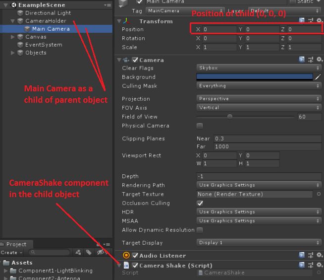

# *Camera Shake Component Documentation*

This *documentation* explain how to use the *Camera Shake* component, which is used to Shake the camera using a simple call with parameters, and using noise for randomness.

## *Camera Shake*

This behaviour controls the shakes of the camera and the call from an outside script to start the shake with configurable parameters.

## *Camera Set Up*

In order to use the shake component, the camera *GameObject* needs to be the child of another *GameObject*. The **parent** object will act as the base position of the camera, it is this object that needs to be move by any other camera movement component. The **child** object should have the Camera component as well as the Camera Shake component. The position of the child object should be **(0, 0, 0)**.



## *Call a new Shake*

To instantiate a camera shake, call the public method Shake() from the CameraShake component. First, create a reference to the CameraShake script. Then, simply call the Shake() method, using four parameters: **Shake(float speed, float amplitude, float duration, bool useZAxis)**

Example:
```c#
[SerializeField] private CameraShake shake;

// This line goes inside a function
shake.Shake(15f, 0.3f, 0.5f, true);
```

### Call parameters

* *float speed*: the speed at which the script scroll through the noise texture.
* *float amplitude*: The range for the offset of the camera, how far away does the camera moves from it's base position.
* *float duration*: The duration of the shake in seconds.
* *bool useZAxis*: Set to *true* for the shake to also affect the forward (blue) axis. Set to false only shake the camera on the XY plane.

### Notes

The *CameraShake* uses a curve to ease *In* and *Out* of the shake. By default, it ease *in and out* in 0.08 seconds. If you wish to modify these values, Open the *CameraShake* script and modify the values in the *Start* method.

If a **shake** is currently affecting the camera, you have to wait for it to finish to call another one. Otherwise, the second call will simply be *ignored*.

See the *example scene* to test different values parameters.
